# Analytics Visualization Guide

This guide explains how FishMe uses Mermaid charts for analytics visualization.

## Overview

FishMe provides visual analytics using Mermaid diagrams and charts. These visualizations help you understand:
- Template performance
- Capture distribution
- Session statistics
- Geographic data
- Time-based trends

## Mermaid Chart Types Used

### 1. Pie Charts

Pie charts show distribution of data across categories.

#### Template Performance Distribution

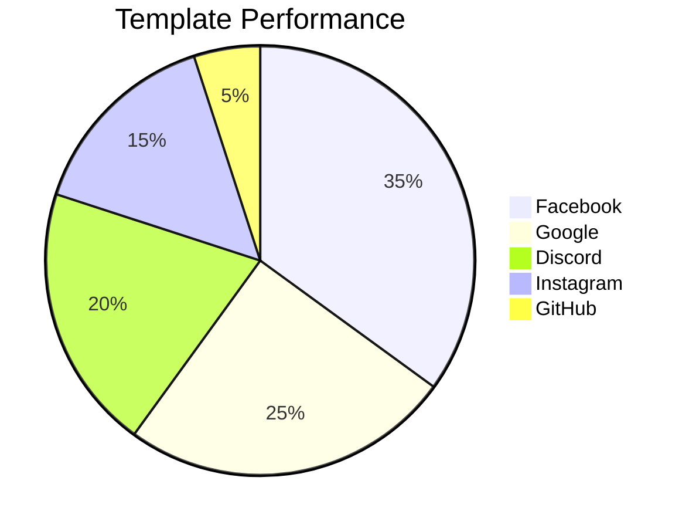

**Text Explanation**: Facebook accounts for 35% of all captures, followed by Google at 25%, Discord at 20%, Instagram at 15%, and GitHub at 5%.

#### Capture by Category

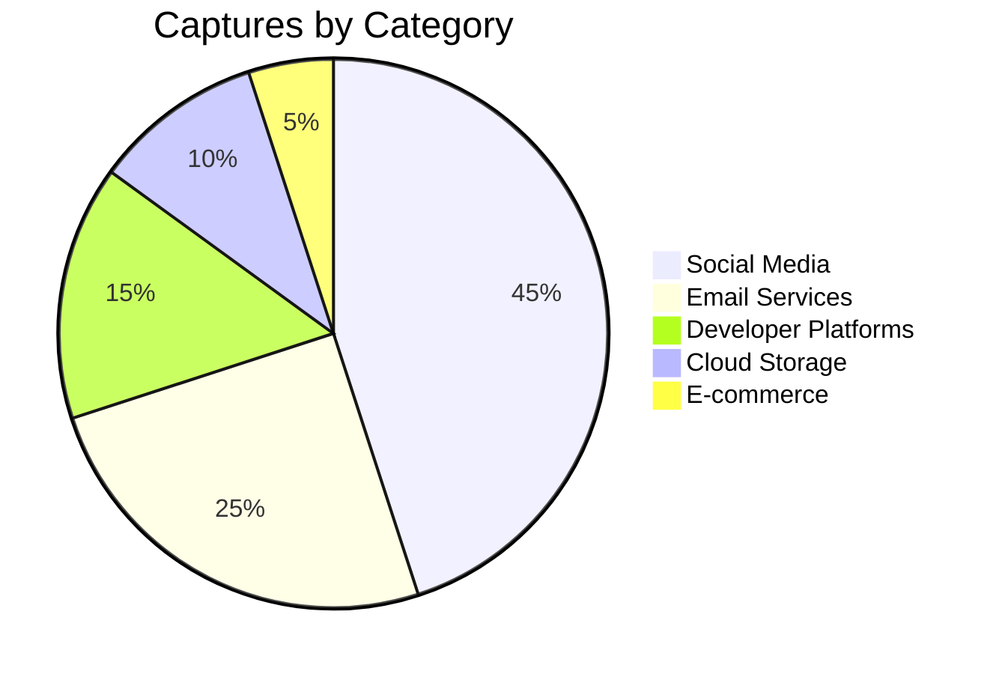

**Text Explanation**: Social media templates account for 45% of captures, email services for 25%, developer platforms for 15%, cloud storage for 10%, and e-commerce for 5%.

### 2. Bar Charts

Bar charts show comparison of values across categories.

#### Captures by Date

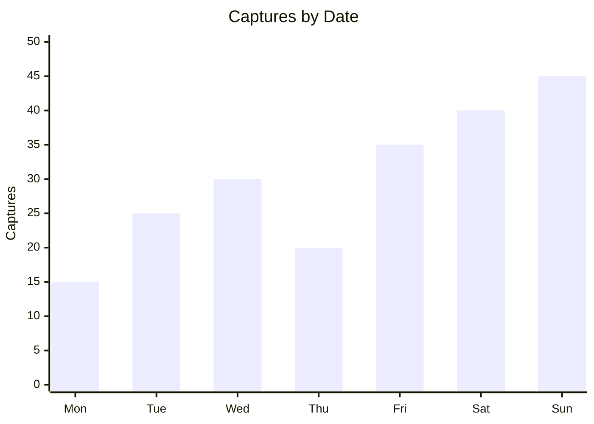

**Text Explanation**: Captures peaked on Sunday with 45 captures, followed by Saturday with 40, Friday with 35, Wednesday with 30, Tuesday with 25, Monday with 15, and Thursday with 20.

#### Template Comparison

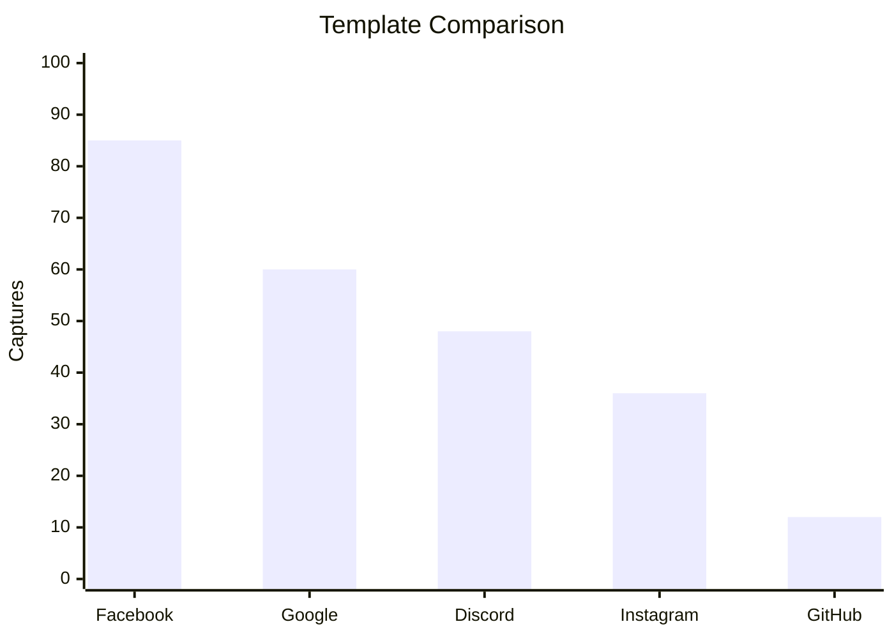

**Text Explanation**: Facebook has the highest capture count at 85, followed by Google at 60, Discord at 48, Instagram at 36, and GitHub at 12.

### 3. Line Charts

Line charts show trends over time.

#### Weekly Trend

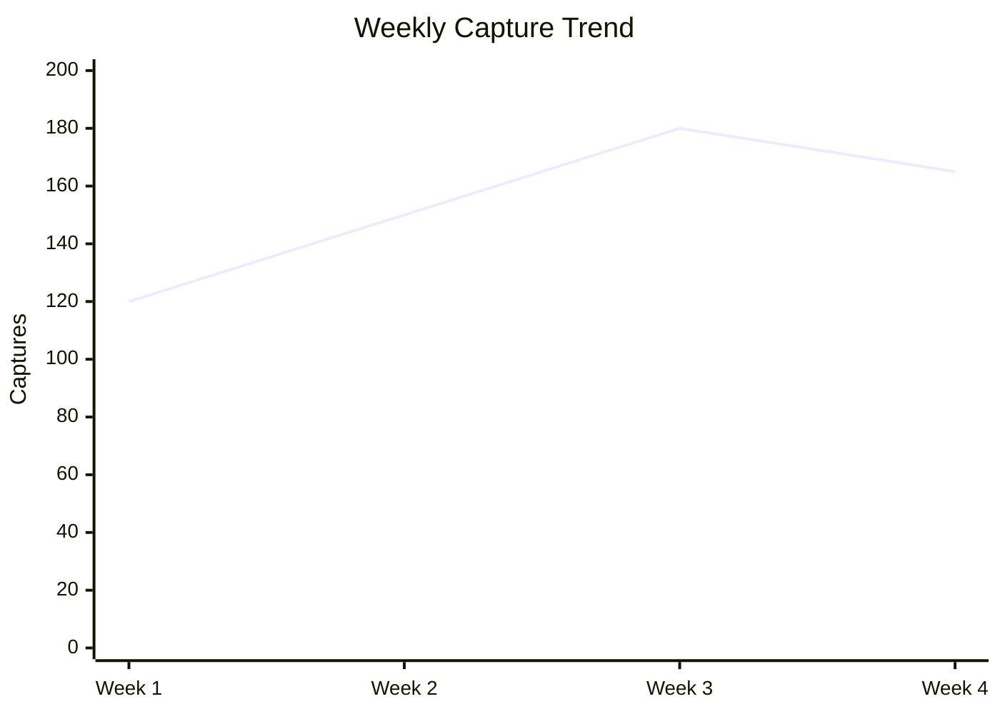

**Text Explanation**: Captures increased from 120 in Week 1 to 150 in Week 2, peaked at 180 in Week 3, then decreased to 165 in Week 4.

### 4. Flow Charts

Flow charts show process flows and data movement.

#### Data Capture Flow

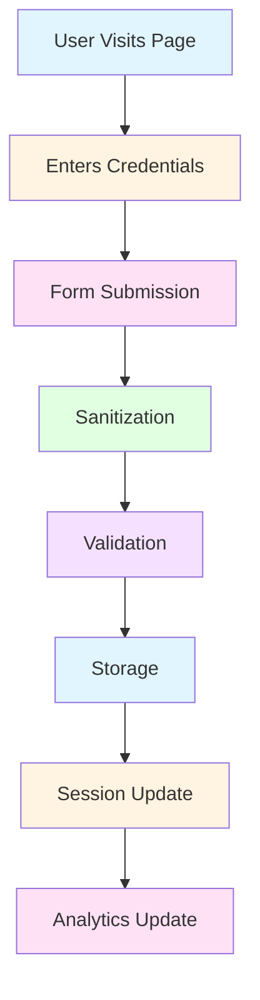

**Text Explanation**: The capture process starts when a user visits the page, enters credentials, submits the form, which then goes through sanitization, validation, storage, session update, and analytics update.

### 5. Graph Charts

Graph charts show relationships between entities.

#### Template Relationships

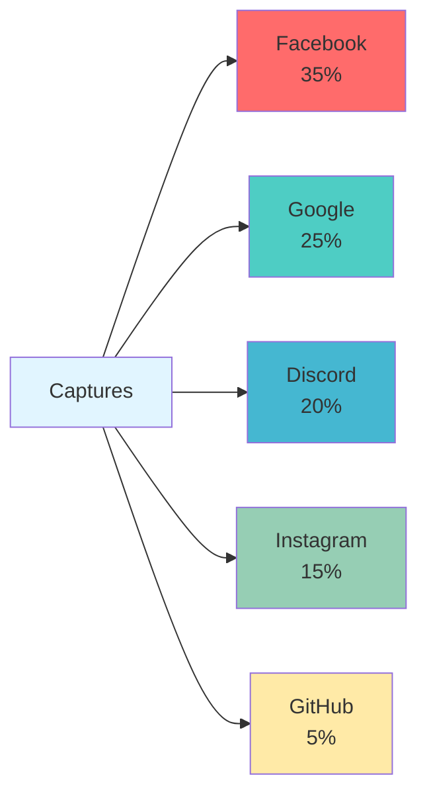

**Text Explanation**: All captures are distributed across templates: Facebook (35%), Google (25%), Discord (20%), Instagram (15%), and GitHub (5%).

### 6. State Diagrams

State diagrams show state transitions.

#### Session Lifecycle

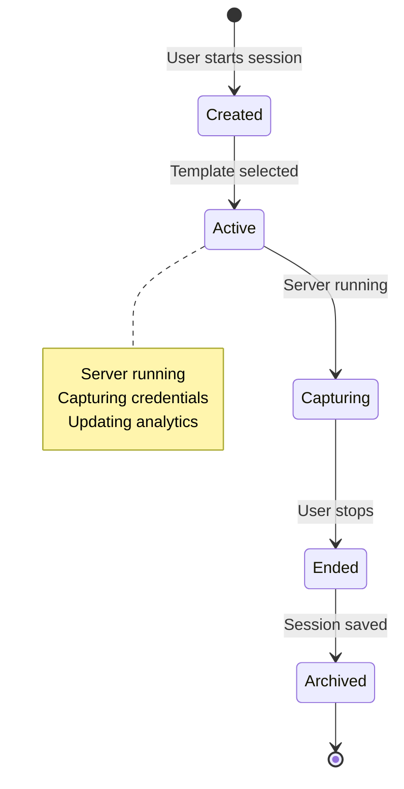

**Text Explanation**: Sessions start in Created state, move to Active when template is selected, then to Capturing when server is running, then to Ended when user stops, then to Archived when saved, and finally terminated.

## Generating Analytics with FishMe

### Quick Summary

```bash
fishme stats quick
```

This displays:
- Total captures
- Top templates
- Recent activity
- Quick statistics

### Full Report

```bash
fishme stats report
```

This generates:
- Comprehensive statistics
- Template performance
- Time-based analysis
- Geographic distribution
- User agent analysis

### Generate Charts

```bash
fishme stats chart template
```

Generates template performance chart.

```bash
fishme stats chart date
```

Generates date-based trend chart.

### Export Statistics

```bash
fishme stats export stats.json
```

Exports statistics to JSON for further analysis.

## Custom Chart Examples

### Geographic Distribution

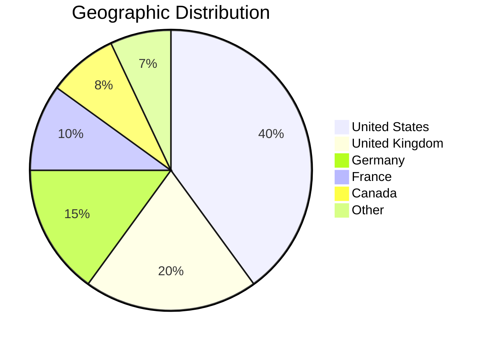

**Text Explanation**: 40% of captures originated from the United States, 20% from the United Kingdom, 15% from Germany, 10% from France, 8% from Canada, and 7% from other countries.

### User Agent Distribution

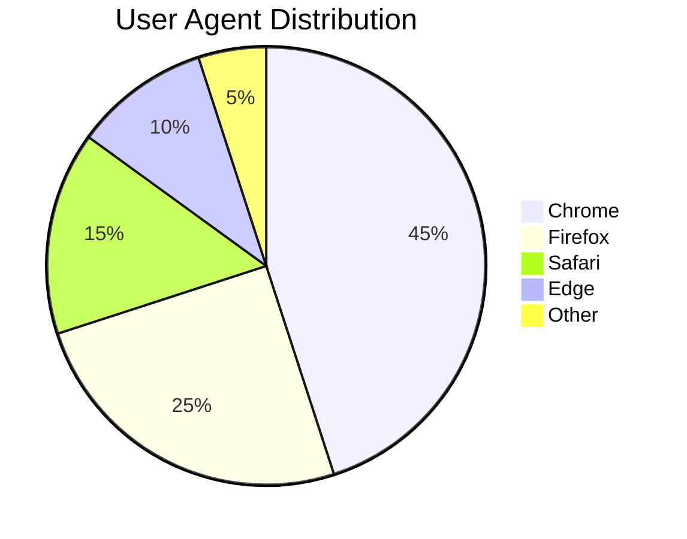

**Text Explanation**: Chrome accounts for 45% of user agents, Firefox for 25%, Safari for 15%, Edge for 10%, and other browsers for 5%.

### Hourly Activity

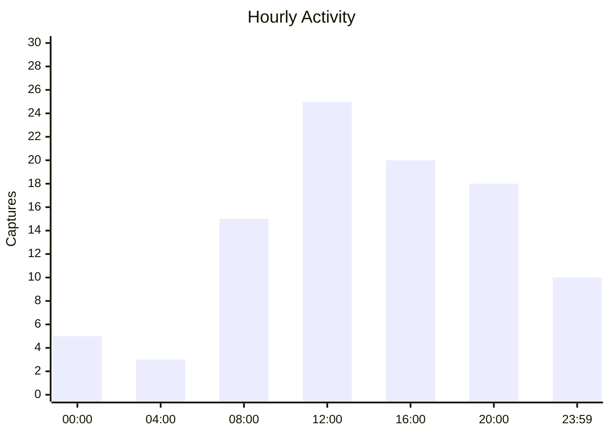

**Text Explanation**: Activity peaks at 12:00 with 25 captures, followed by 16:00 with 20 captures, 08:00 with 15 captures, 20:00 with 18 captures, 23:59 with 10 captures, 00:00 with 5 captures, and 04:00 with 3 captures.

## Integration with Reports

### HTML Reports

HTML reports include embedded Mermaid charts for visual representation of data.

### PDF Reports

PDF reports include static images generated from Mermaid charts.

### Markdown Reports

Markdown reports include Mermaid code blocks that render in supported viewers.

### JSON Reports

JSON reports include raw data that can be used to generate custom Mermaid charts.

## Best Practices

### Chart Selection

- **Pie Charts**: Use for showing parts of a whole (percentages)
- **Bar Charts**: Use for comparing values across categories
- **Line Charts**: Use for showing trends over time
- **Flow Charts**: Use for showing processes and workflows
- **Graph Charts**: Use for showing relationships
- **State Diagrams**: Use for showing state transitions

### Color Schemes

Use consistent color schemes across charts:
- Blue tones for primary data
- Green tones for positive metrics
- Red tones for alerts
- Yellow/Orange for warnings
- Gray for neutral elements

### Labels and Titles

- Always include descriptive titles
- Use clear, concise labels
- Include units where applicable
- Add legends when necessary

### Accessibility

- Provide text descriptions for all charts
- Use high-contrast colors
- Ensure charts are readable at different sizes
- Include alternative text for screen readers

## Advanced Visualizations

### Multi-Variable Charts

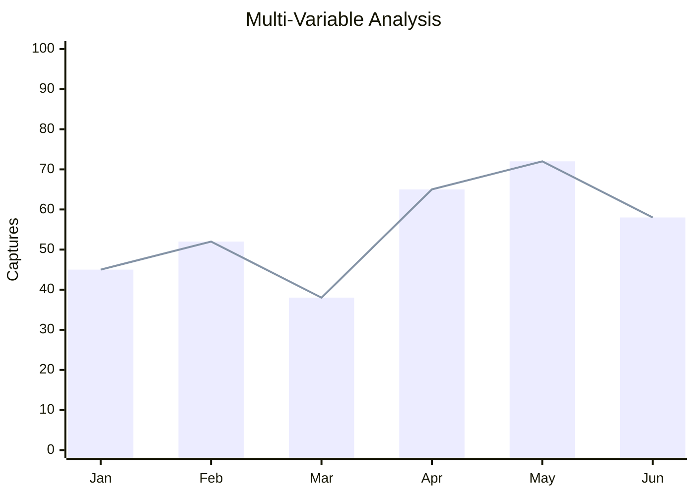

**Text Explanation**: Shows both bar and line representations of the same data for comparison.

### Comparative Analysis

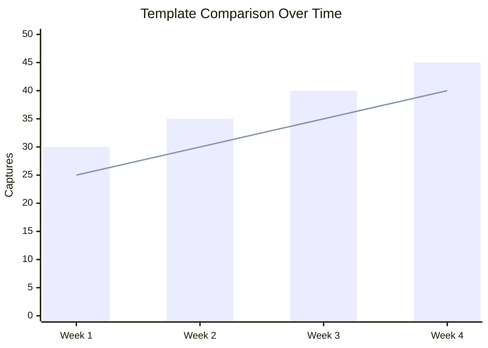

**Text Explanation**: Compares two metrics over time - bar shows total captures, line shows successful captures.

## Troubleshooting

### Charts Not Rendering

If Mermaid charts are not rendering:
1. Ensure your Markdown viewer supports Mermaid
2. Check for syntax errors in Mermaid code
3. Verify chart data is valid
4. Check browser console for errors

### Incorrect Data

If chart data appears incorrect:
1. Verify capture files are valid JSON
2. Check for duplicate entries
3. Ensure timestamps are correct
4. Run `fishme stats quick` to verify data

### Performance Issues

If charts are slow to render:
1. Reduce data points in charts
2. Use simpler chart types
3. Cache chart images
4. Optimize data queries

## Resources

- [Mermaid Documentation](https://mermaid.js.org/)
- [Mermaid Live Editor](https://mermaid.live/)
- [Chart Best Practices](https://www.datavizproject.com/)
- [Accessibility Guidelines](https://www.w3.org/WAI/tutorials/images/decision-tree/)

---

**Last Updated**: 2026-06-13
