# Architecture Documentation

This document describes the architecture of FishMe, including its components, data flow, and design decisions.

## Table of Contents

- [Overview](#overview)
- [System Architecture](#system-architecture)
- [Component Architecture](#component-architecture)
- [Data Flow](#data-flow)
- [Directory Structure](#directory-structure)
- [Library Modules](#library-modules)
- [Plugin System](#plugin-system)
- [Configuration System](#configuration-system)
- [Logging System](#logging-system)
- [Security Architecture](#security-architecture)
- [Design Decisions](#design-decisions)

## Overview

FishMe is a CLI-based phishing  platform built with Bash and PHP. It follows a modular architecture with separate library modules for different functionalities.

### Key Principles

- **Modularity**: Each feature is a separate library module
- **Extensibility**: Plugin system for custom functionality
- **Security**: Input sanitization and validation
- **Direct**: Phishing tool for creating and managing campaigns
- **CLI-First**: Command-line interface for all operations

## System Architecture

### High-Level Architecture

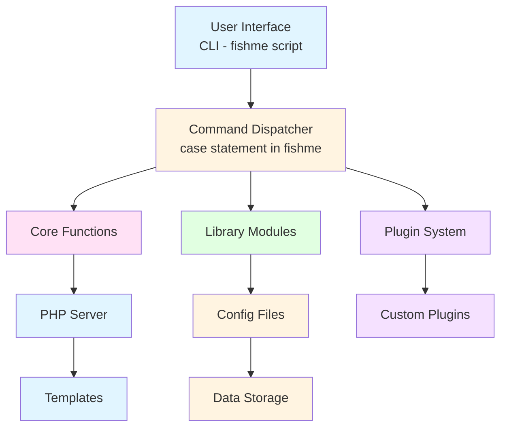

## Component Architecture

### Core Components

#### 1. Main Script (fishme)

The main entry point that:
- Parses command-line arguments
- Dispatches to appropriate command handlers
- Loads library modules
- Initializes systems
- Displays help and version information

#### 2. PHP Backend

PHP files that handle:
- Web server routing (router.php)
- Configuration (config.php)
- Capture processing (capture.php)
- Data viewing (viewer.php)
- Template serving

#### 3. Library Modules

Modular bash scripts that provide:
- Configuration management
- Logging
- Template management
- Export/import
- Analytics
- Session management
- Template generation
- Report generation
- Multi-site management
- Plugin management

### Component Interactions

```
User → CLI → Command Handler → Library Module → PHP Backend → Data Storage
```

## Data Flow

### Server Startup Flow

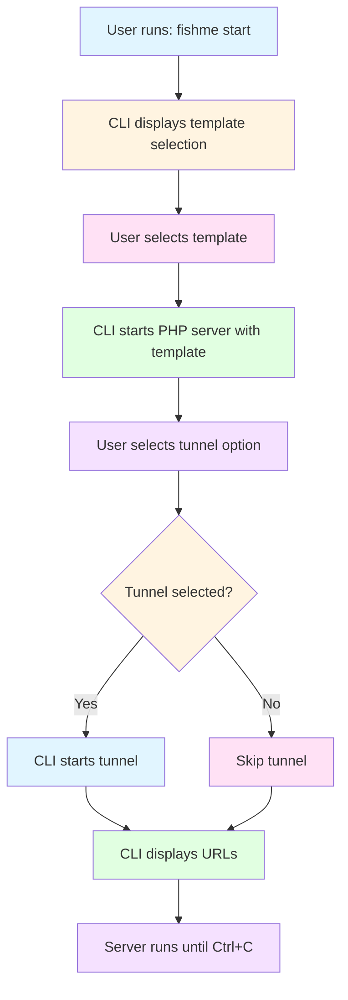

### Capture Flow

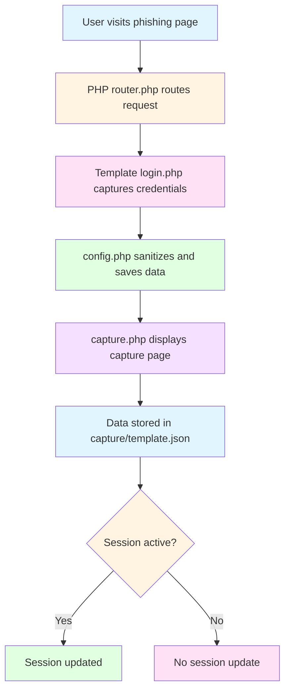

### Analytics Flow

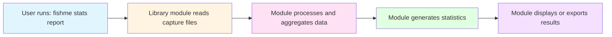

## Directory Structure

```mermaid
graph TD
    A[FishMe] --> B[fishme<br/>Main executable script]
    A --> C[PHP Backend]
    A --> D[templates<br/>Phishing templates]
    A --> E[lib<br/>Library modules]
    A --> F[config<br/>Configuration files]
    A --> G[capture<br/>Captured credentials]
    A --> H[logs<br/>Log files]
    A --> I[sessions<br/>Session data]
    A --> J[exports<br/>Exported data]
    A --> K[reports<br/>Generated reports]
    A --> L[plugins<br/>Custom plugins]
    A --> M[.multi_site<br/>Multi-site configs]
    A --> N[.cache<br/>Cache directory]
    A --> O[.backups<br/>Template backups]
    A --> P[.template_styles<br/>Template styles]
    A --> Q[docs<br/>Documentation]
    
    C --> C1[config.php]
    C --> C2[router.php]
    C --> C3[capture.php]
    C --> C4[viewer.php]
    
    D --> D1[template_name/]
    D1 --> D1a[site.json]
    D1 --> D1b[index.php]
    D1 --> D1c[login.html]
    D1 --> D1d[login.php]
    D1 --> D1e[script.js]
    D1 --> D1f[style.css]
    
    E --> E1[config_loader.sh]
    E --> E2[logger.sh]
    E --> E3[template_manager.sh]
    E --> E4[export_manager.sh]
    E --> E5[analytics.sh]
    E --> E6[session_manager.sh]
    E --> E7[template_generator.sh]
    E --> E8[report_generator.sh]
    E --> E9[multi_site_manager.sh]
    E --> E10[plugin_manager.sh]
    
    F --> F1[fishme.conf]
    
    G --> G1[template.json]
    
    H --> H1[fishme.log]
    
    I --> I1[session_id.json]
    
    J --> J1[export_file]
    
    K --> K1[report_file]
    
    L --> L1[plugin_name/]
    L1 --> L1a[plugin.json]
    L1 --> L1b[plugin.sh]
    
    M --> M1[configs/]
    M --> M2[site_pids]
    
    N --> N1[templates/]
    N --> N2[analytics/]
    
    O --> O1[templates/]
    
    P --> P1[modern.css]
    P --> P2[corporate.css]
    P --> P3[dark.css]
    
    Q --> Q1[SECURITY.md]
    Q --> Q2[RELEASES.md]
    Q --> Q3[CATALOG.md]
    Q --> Q4[CONTRIBUTING.md]
    Q --> Q5[INSTALLATION.md]
    Q --> Q6[TROUBLESHOOTING.md]
    Q --> Q7[ARCHITECTURE.md]
    
    style A fill:#e1f5ff
    style B fill:#fff4e1
    style C fill:#ffe1f5
    style D fill:#e1ffe1
    style E fill:#f5e1ff
    style F fill:#e1f5ff
    style G fill:#fff4e1
    style H fill:#ffe1f5
    style I fill:#e1ffe1
    style J fill:#f5e1ff
    style K fill:#e1f5ff
    style L fill:#fff4e1
    style M fill:#ffe1f5
    style N fill:#e1ffe1
    style O fill:#f5e1ff
    style P fill:#e1f5ff
    style Q fill:#fff4e1
```

## Library Modules

### 1. Config Loader (config_loader.sh)

**Purpose**: Centralized configuration management

**Functions**:
- `init_config()` - Initialize configuration
- `load_config()` - Load configuration from file
- `get_config()` - Get configuration value
- `set_config()` - Set configuration value
- `has_config()` - Check if key exists

**Data Flow**:
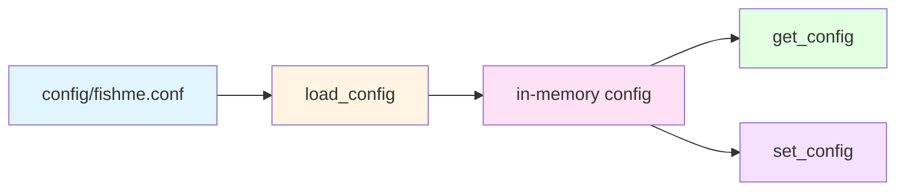

### 2. Logger (logger.sh)

**Purpose**: Comprehensive logging system

**Functions**:
- `init_logging()` - Initialize logging
- `log_debug()` - Log debug message
- `log_info()` - Log info message
- `log_warn()` - Log warning
- `log_error()` - Log error
- `log_fatal()` - Log fatal error
- `get_recent_logs()` - Get recent logs
- `search_logs()` - Search logs
- `get_log_stats()` - Get log statistics

**Log Levels**: DEBUG, INFO, WARN, ERROR, FATAL

### 3. Template Manager (template_manager.sh)

**Purpose**: Template CRUD operations

**Functions**:
- `init_template_manager()` - Initialize
- `list_templates()` - List all templates
- `get_template_info()` - Get template info
- `create_template()` - Create template
- `delete_template()` - Delete template
- `backup_template()` - Backup template
- `restore_template()` - Restore template
- `export_template()` - Export template
- `import_template()` - Import template
- `validate_template()` - Validate template

### 4. Export Manager (export_manager.sh)

**Purpose**: Export/import captured data

**Functions**:
- `init_export_manager()` - Initialize
- `export_captures_csv()` - Export to CSV
- `export_captures_json()` - Export to JSON
- `export_captures_xml()` - Export to XML
- `export_captures_html()` - Export to HTML
- `export_all_formats()` - Export all formats
- `import_captures_csv()` - Import from CSV
- `import_captures_json()` - Import from JSON

### 5. Analytics (analytics.sh)

**Purpose**: Statistics and analytics

**Functions**:
- `init_analytics()` - Initialize
- `generate_stats_report()` - Generate report
- `generate_template_chart()` - Generate template chart
- `generate_date_chart()` - Generate date chart
- `show_quick_summary()` - Show summary
- `export_stats_json()` - Export stats

### 6. Session Manager (session_manager.sh)

**Purpose**: Session lifecycle management

**Functions**:
- `init_session_manager()` - Initialize
- `create_session()` - Create session
- `end_session()` - End session
- `get_session_info()` - Get session info
- `list_sessions()` - List sessions
- `delete_session()` - Delete session
- `export_session()` - Export session
- `import_session()` - Import session
- `cleanup_old_sessions()` - Cleanup old sessions
- `check_orphaned_sessions()` - Check orphans

### 7. Template Generator (template_generator.sh)

**Purpose**: Interactive template creation

**Functions**:
- `init_template_generator()` - Initialize
- `create_template_interactive()` - Interactive wizard
- `create_template_from_params()` - Create from parameters
- `clone_template()` - Clone existing template
- `validate_generated_template()` - Validate generated template

### 8. Report Generator (report_generator.sh)

**Purpose**: Generate reports

**Functions**:
- `init_report_generator()` - Initialize
- `generate_html_report()` - Generate HTML
- `generate_pdf_report()` - Generate PDF
- `generate_markdown_report()` - Generate Markdown
- `generate_json_report()` - Generate JSON
- `generate_all_reports()` - Generate all formats
- `list_reports()` - List reports
- `delete_report()` - Delete report

### 9. Multi-Site Manager (multi_site_manager.sh)

**Purpose**: Run multiple sites

**Functions**:
- `init_multi_site_manager()` - Initialize
- `create_site_config()` - Create site config
- `list_site_configs()` - List sites
- `start_site()` - Start site
- `stop_site()` - Stop site
- `stop_all_sites()` - Stop all sites
- `get_site_status()` - Get status
- `delete_site_config()` - Delete config
- `monitor_sites()` - Monitor sites
- `check_site_health()` - Check health

### 10. Plugin Manager (plugin_manager.sh)

**Purpose**: Plugin system

**Functions**:
- `init_plugin_manager()` - Initialize
- `list_plugins()` - List plugins
- `load_plugin()` - Load plugin
- `enable_plugin()` - Enable plugin
- `disable_plugin()` - Disable plugin
- `create_plugin()` - Create plugin
- `delete_plugin()` - Delete plugin
- `export_plugin()` - Export plugin
- `import_plugin()` - Import plugin
- `validate_plugin()` - Validate plugin
- `call_plugin_hook()` - Call plugin hooks

## Plugin System

### Plugin Architecture

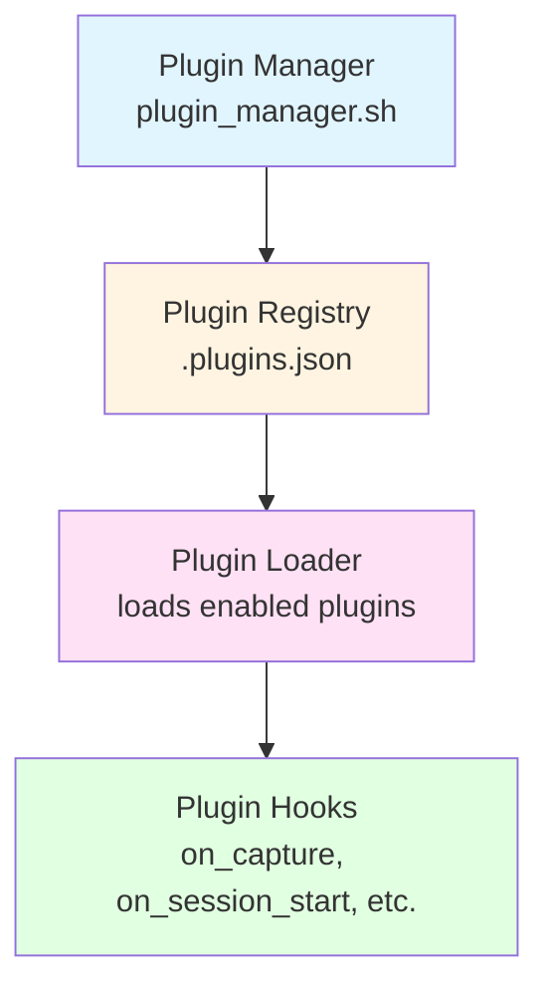

### Plugin Structure

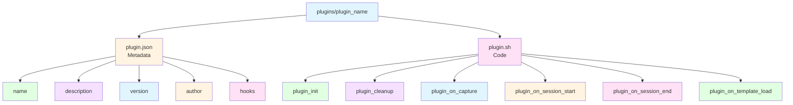

### Plugin Lifecycle

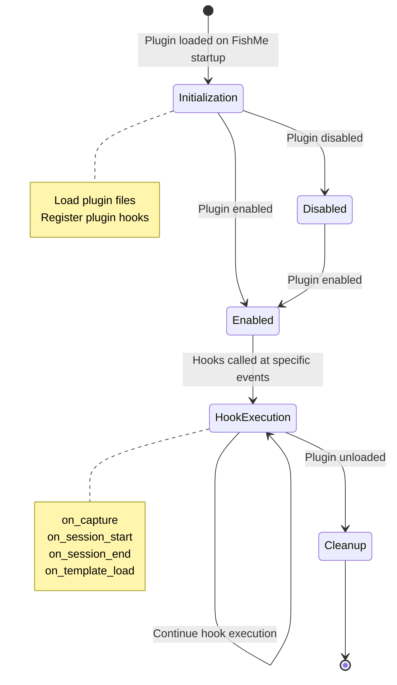

## Configuration System

### Configuration Architecture

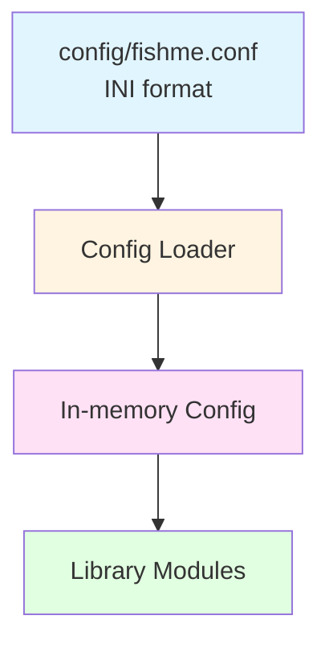

### Configuration Sections

- **[server]**: Server settings (host, port)
- **[tunnel]**: Tunnel settings (type, tokens)
- **[paths]**: Directory paths
- **[logging]**: Logging settings (level, file, rotation)
- **[templates]**: Template settings (default, cache)
- **[capture]**: Capture settings (format, export)
- **[ui]**: UI settings (colors, banner)
- **[security]**: Security settings (sanitization, limits)

## Logging System

### Logging Architecture

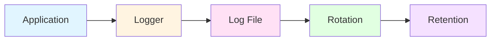

### Log Format

```
[YYYY-MM-DD HH:MM:SS] [LEVEL] [MODULE] Message
```

### Log Rotation

- **Max Size**: 10MB (configurable)
- **Retention**: 7 days (configurable)
- **Backup**: .log.1, .log.2, etc.

## Security Architecture

### Security Layers

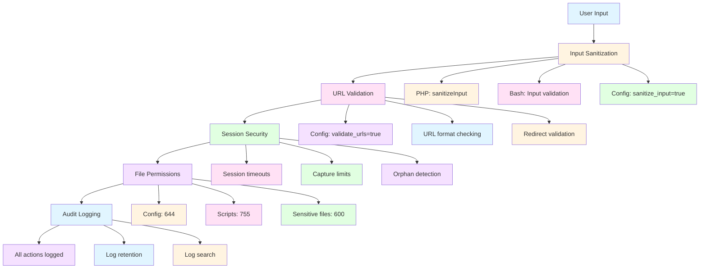

### Data Flow Security

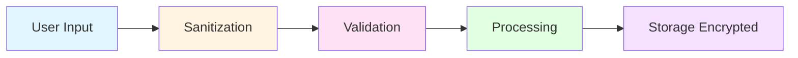

## Design Decisions

### Why Bash?

- **Portability**: Available on all Unix-like systems
- **CLI-Native**: Perfect for command-line tools
- **Integration**: Easy to integrate with system tools
- **Simplicity**: No compilation required

### Why PHP?

- **Web Server**: Built-in PHP server
- **Templates**: Easy to create dynamic pages
- **Ecosystem**: Large library ecosystem
- **Familiarity**: Widely known

### Why Modular Architecture?

- **Maintainability**: Easier to maintain separate modules
- **Extensibility**: Easy to add new features
- **Testing**: Easier to test individual modules
- **Reusability**: Modules can be reused

### Why Plugin System?

- **Customization**: Users can add custom functionality
- **Extensibility**: Core remains stable
- **Community**: Community can contribute plugins
- **Flexibility**: Adapt to different use cases

### Why INI Configuration?

- **Readability**: Human-readable format
- **Simplicity**: Easy to parse
- **Standard**: Widely used format
- **Editing**: Easy to edit manually

## Future Architecture

### Planned Improvements

1. **Web Dashboard**
   - React-based UI
   - Real-time monitoring
   - Visual analytics

2. **API Layer**
   - REST API
   - Authentication
   - Rate limiting

3. **Database Backend**
   - PostgreSQL/MySQL support
   - Better query performance
   - Data integrity

4. **Microservices**
   - Separate services for different features
   - Better scalability
   - Independent deployment

5. **Containerization**
   - Docker support
   - Kubernetes deployment
   - Easy scaling

---

**Last Updated**: 2026-06-13
