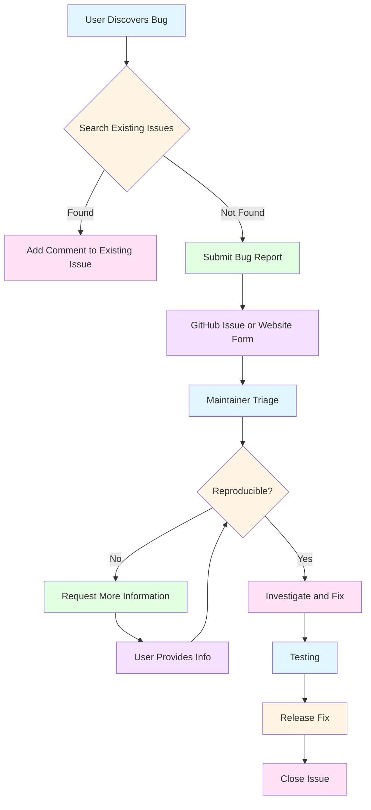

# Bug Reports

This guide explains how to report bugs and issues with FishMe.

## Table of Contents

- [Overview](#overview)
- [Before Reporting](#before-reporting)
- [Reporting via GitHub](#reporting-via-github)
- [Reporting via Website](#reporting-via-website)
- [Bug Report Template](#bug-report-template)
- [Security Vulnerabilities](#security-vulnerabilities)
- [Feature Requests](#feature-requests)
- [What Happens Next](#what-happens-next)
- [Best Practices](#best-practices)

## Overview

FishMe welcomes bug reports from users to help improve the tool. There are two ways to submit bug reports:

1. **GitHub Issues** - For public bug reports and feature requests
2. **Website Form** - For direct submission to the FishMe team

## Before Reporting

Before submitting a bug report, please:

1. **Search Existing Issues**
   - Check if the bug has already been reported
   - Review closed issues to see if it was already fixed
   - Search using keywords related to your issue

2. **Verify the Bug**
   - Ensure the bug is reproducible
   - Test on the latest version of FishMe
   - Check if the issue is environment-specific

3. **Gather Information**
   - FishMe version: `fishme -v`
   - Operating system and version
   - PHP version: `php -v`
   - Steps to reproduce the issue
   - Expected behavior vs actual behavior
   - Error messages or logs
   - Screenshots (if applicable)

## Reporting via GitHub

### Creating a GitHub Issue

1. **Visit the GitHub Repository**
   - Go to: https://github.com/syed-sameer-ul-hassan/FishME/issues
   - Click "New Issue"

2. **Choose the Right Template**
   - Bug Report - For bugs and defects
   - Feature Request - For new features or enhancements
   - Documentation - For documentation issues
   - Question - For general questions

3. **Fill in the Template**
   - Provide a descriptive title
   - Fill in all required fields
   - Attach logs and screenshots
   - Include relevant code snippets

4. **Submit the Issue**
   - Review your report
   - Click "Submit new issue"

### GitHub Issue Labels

After submission, your issue will be labeled:

- `bug` - Confirmed bug
- `enhancement` - Feature request
- `documentation` - Documentation issue
- `question` - General question
- `wontfix` - Won't be fixed
- `duplicate` - Duplicate of existing issue
- `help wanted` - Community help needed
- `good first issue` - Good for newcomers

## Reporting via Website

### Submitting via FishMe Website

1. **Visit the Bug Report Form**
   - Go to: https://fishme.orildo.sbs/reports/bug
   - Or use the direct link: https://fishme.orildo.sbs/reports/bug

2. **Fill in the Form**
   - Your name (optional)
   - Email address (optional, for follow-up)
   - Bug category
   - Severity level
   - Description of the issue
   - Steps to reproduce
   - Expected behavior
   - Actual behavior
   - Attach logs/screenshots

3. **Submit the Report**
   - Review your submission
   - Click "Submit Bug Report"

### Bug Categories

- **Installation** - Issues with installation or setup
- **Configuration** - Configuration file issues
- **Templates** - Template-related problems
- **Tunneling** - Cloudflare or LocalXpose issues
- **Capture** - Credential capture problems
- **Export/Import** - Data export/import issues
- **Analytics** - Statistics and analytics problems
- **Multi-Site** - Multi-site management issues
- **Plugins** - Plugin system problems
- **Performance** - Performance-related issues
- **UI/CLI** - User interface or CLI issues
- **Documentation** - Documentation errors
- **Other** - Other issues not listed

### Severity Levels

- **Critical** - System crash, data loss, security vulnerability
- **High** - Major functionality broken, workaround available
- **Medium** - Minor functionality broken, workaround available
- **Low** - Cosmetic issue, minor inconvenience
- **Trivial** - Very minor issue, no impact

## Bug Report Template

### GitHub Issue Template

```markdown
**Bug Description**
A clear and concise description of what the bug is.

**To Reproduce**
Steps to reproduce the behavior:
1. Run 'fishme start'
2. Select template 'facebook'
3. Choose 'Cloudflare' tunnel
4. See error

**Expected Behavior**
A clear description of what you expected to happen.

**Actual Behavior**
A clear description of what actually happened.

**Screenshots**
If applicable, add screenshots to help explain your problem.

**Environment**
- FishMe Version: [e.g., 1.0.0]
- Operating System: [e.g., Ubuntu 22.04]
- PHP Version: [e.g., 8.1.2]
- Bash Version: [e.g., 5.1.16]

**Logs**
```
Paste relevant log output here
```

**Additional Context**
Add any other context about the problem here.
```

### Website Form Template

**Title**: [Brief description of the bug]

**Category**: [Select appropriate category]

**Severity**: [Select severity level]

**Description**:
[Detailed description of the bug]

**Steps to Reproduce**:
1. [Step 1]
2. [Step 2]
3. [Step 3]

**Expected Behavior**:
[What you expected to happen]

**Actual Behavior**:
[What actually happened]

**Environment**:
- FishMe Version: [e.g., 1.0.0]
- Operating System: [e.g., Ubuntu 22.04]
- PHP Version: [e.g., 8.1.2]

**Logs**:
[Paste relevant log output]

**Attachments**:
[Upload screenshots or log files]

## Security Vulnerabilities

**IMPORTANT**: Do NOT report security vulnerabilities via GitHub issues or the website form.

For security vulnerabilities, please:

1. **Use GitHub Security Advisories**
   - Go to: https://github.com/syed-sameer-ul-hassan/FishME/security/advisories
   - Click "Report a vulnerability"
   - Follow the security reporting process

2. **Email Security Team**
   - Email: security@example.com (placeholder)
   - Subject: [Security] FishMe Vulnerability Report
   - Include detailed description and proof of concept

3. **What to Include**
   - Description of the vulnerability
   - Steps to reproduce
   - Impact assessment
   - Proof of concept (if applicable)
   - Suggested fix (if known)

**Response Time**:
- Acknowledgment within 48 hours
- Detailed response within 7 days
- Fix timeline based on severity

## Feature Requests

For new features or enhancements:

1. **Use GitHub Issues**
   - Select "Feature Request" template
   - Describe the feature clearly
   - Explain the use case
   - Provide examples if possible

2. **Feature Request Template**
```markdown
**Feature Description**
A clear and concise description of the feature.

**Use Case**
Describe the use case for this feature. Why would it be useful?

**Proposed Solution**
Describe how you envision this feature working.

**Alternatives**
Describe any alternative solutions or features you've considered.

**Additional Context**
Add any other context, screenshots, or examples about the feature request.
```

## What Happens Next

### After Submission

1. **Triage**
   - Your report will be reviewed by maintainers
   - It will be categorized and labeled
   - You'll receive acknowledgment within 48 hours

2. **Investigation**
   - Maintainers will investigate the issue
   - They may ask for additional information
   - They will attempt to reproduce the bug

3. **Resolution**
   - Bug will be fixed in an upcoming release
   - You'll be notified when it's fixed
   - The issue will be closed when resolved

### Timeline

- **Acknowledgment**: Within 48 hours
- **Initial Response**: Within 7 days
- **Critical Bugs**: Fixed within 7-14 days
- **High Priority**: Fixed within 14-30 days
- **Medium Priority**: Fixed within 30-60 days
- **Low Priority**: Fixed as time permits

## Best Practices

### Writing Good Bug Reports

1. **Be Specific**
   - Use clear, descriptive titles
   - Provide exact error messages
   - Include version numbers

2. **Be Reproducible**
   - Provide step-by-step instructions
   - Include exact commands used
   - Describe the environment

3. **Be Complete**
   - Include all relevant information
   - Attach logs and screenshots
   - Provide context

4. **Be Professional**
   - Use respectful language
   - Focus on the issue, not the person
   - Be patient with the response time

### What to Include

- **Version Information**: FishMe version, OS, PHP version
- **Steps to Reproduce**: Clear, numbered steps
- **Expected vs Actual**: What you expected vs what happened
- **Error Messages**: Exact error text or screenshots
- **Logs**: Relevant log output
- **Environment Details**: System configuration
- **Attachments**: Screenshots, log files, configuration files

### What NOT to Include

- **Personal Information**: Remove sensitive data from logs
- **Passwords**: Never include passwords or API keys
- **Irrelevant Information**: Keep the report focused
- **Multiple Issues**: Report one issue per bug report
- **Duplicate Reports**: Search before submitting

## Common Issues

### Installation Issues

**Problem**: FishMe won't install

**Before Reporting**:
- Check PHP version: `php -v`
- Check if dependencies are installed
- Review installation logs
- Try manual installation

### Template Issues

**Problem**: Template not working

**Before Reporting**:
- Validate template: `fishme template validate <name>`
- Check template structure
- Review template logs
- Test with a different template

### Tunneling Issues

**Problem**: Tunnel not working

**Before Reporting**:
- Check if cloudflared/loclx is installed
- Verify API tokens
- Check network connectivity
- Try a different tunnel type

### Capture Issues

**Problem**: Credentials not being captured

**Before Reporting**:
- Check if PHP server is running
- Verify template login.php is correct
- Review capture logs
- Check file permissions

## Getting Help

### Documentation

- **Installation Guide**: [INSTALLATION.md](INSTALLATION.md)
- **Troubleshooting**: [TROUBLESHOOTING.md](TROUBLESHOOTING.md)
- **Template Creation**: [TEMPLATE_CREATION.md](TEMPLATE_CREATION.md)
- **Architecture**: [ARCHITECTURE.md](ARCHITECTURE.md)

### Community

- **GitHub Discussions**: https://github.com/syed-sameer-ul-hassan/FishME/discussions
- **GitHub Issues**: https://github.com/syed-sameer-ul-hassan/FishME/issues
- **Website**: https://fishme.orildo.sbs

### Direct Contact

- **Email**: support@example.com (placeholder)
- **Twitter**: @FishMeTool (placeholder)
- **Discord**: FishMe Community Server (placeholder)

## Bug Report Workflow



## Quick Reference

### GitHub Issues
- URL: https://github.com/syed-sameer-ul-hassan/FishME/issues
- Template: Bug Report, Feature Request, Documentation, Question

### Website Form
- URL: https://fishme.orildo.sbs/reports/bug
- Direct: https://fishme.orildo.sbs/reports/bug

### Security
- URL: https://github.com/syed-sameer-ul-hassan/FishME/security/advisories
- Email: security@example.com

### Documentation
- Installation: [INSTALLATION.md](INSTALLATION.md)
- Troubleshooting: [TROUBLESHOOTING.md](TROUBLESHOOTING.md)
- Templates: [TEMPLATE_CREATION.md](TEMPLATE_CREATION.md)

---

**Last Updated**: 2026-06-13
